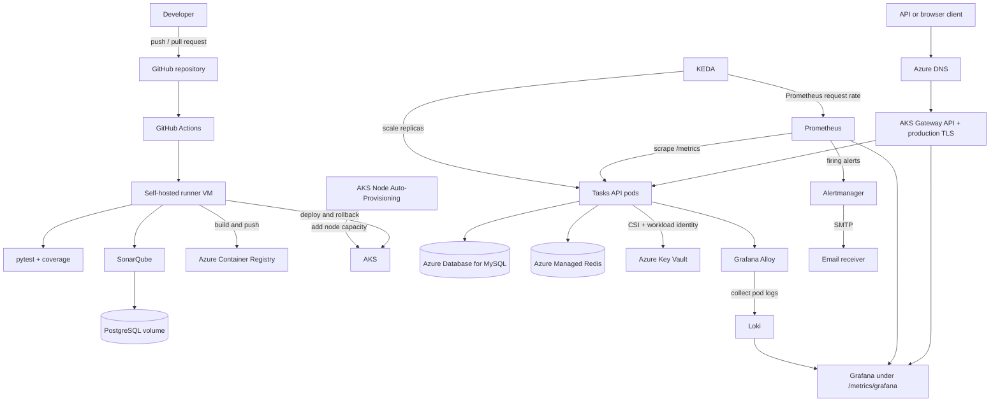

# Tasks API: Azure DevOps Reference Project

A small FastAPI task service used to demonstrate a production-style DevOps platform on Azure. The application is intentionally simple; the project emphasis is infrastructure as code, secure delivery, resilience, observability, autoscaling, and repeatable operations.

Production endpoints:

- API health: `https://api.ruoxi-projects.space/health`
- Tasks API: `https://api.ruoxi-projects.space/tasks`
- Metrics and Grafana entry point: `https://api.ruoxi-projects.space/metrics`

## Project Highlights

- **Infrastructure as code:** Terraform provisions networking, AKS, ACR, MySQL, Azure Managed Redis, Key Vault, DNS, monitoring, autoscaling, and the self-hosted CI runner.
- **Remote state:** a separate bootstrap stack creates the Azure Storage backend used by the main Terraform stack.
- **Secure workload access:** AKS workload identity and the Secrets Store CSI driver deliver runtime configuration without baking secrets into images.
- **Reliable delivery:** GitHub Actions tests, scans, builds, pushes immutable commit tags, deploys to AKS, waits for rollout, and rolls back failed releases.
- **Resilience:** two API replicas, rolling updates, topology spread, pod anti-affinity, health probes, a PodDisruptionBudget, and AKS node auto-provisioning.
- **Two-level autoscaling:** KEDA scales application pods from Prometheus request metrics; AKS Node Auto-Provisioning adds capacity when pods cannot be scheduled.
- **Full observability:** Prometheus collects application and cluster metrics, Alloy ships pod logs to Loki, and Grafana provides metric, business KPI, and log views.
- **Actionable alerting:** Prometheus rules detect elevated errors, p95 latency, and unavailable API targets; Alertmanager can route them through authenticated SMTP.
- **Managed edge:** Azure DNS, ExternalDNS, Gateway API, and cert-manager provide the public hostname and automatically renewed Let's Encrypt production TLS.
- **Data services:** MySQL is the source of truth for tasks; Azure Managed Redis caches `GET /tasks` responses with explicit invalidation after writes.
- **Quality controls:** pytest coverage and SonarQube analysis run on an Azure self-hosted GitHub Actions runner. SonarQube stores analysis state in PostgreSQL on a persistent Docker volume.

## Architecture



## Repository Map

| Path | Purpose |
| --- | --- |
| `app/` | FastAPI service, MySQL access, Redis client, Prometheus metrics, and container image |
| `bootstrap/` | One-time Azure Storage backend for remote Terraform state |
| `infrastructure/` | Main Azure, Kubernetes provider, monitoring, runner, and autoscaling stack |
| `infrastructure/modules/monitoring/` | Prometheus, Alertmanager, Grafana, Loki, Alloy, dashboards, and alert rules |
| `k8s/base/` | Application, Gateway API, TLS, ExternalDNS, KEDA, PDB, and node-pool manifests |
| `k8s/deploy-from-tfstate.sh` | Renders manifests from Terraform outputs and applies them in dependency order |
| `model/` | Example priority-classification workflow and labeled task data |
| `tests/` | API, metric, and cache-related tests |
| `CI_CD_SETUP_GUIDE.md` | Detailed self-hosted runner, SonarQube, secrets, and GitHub Actions setup |

## High-Level Setup

This section gives the sequence and ownership boundaries. For runner registration, SonarQube initialization, GitHub secrets, and workflow behavior, follow [CI_CD_SETUP_GUIDE.md](CI_CD_SETUP_GUIDE.md).

### 1. Prerequisites

Install and authenticate:

- Azure CLI
- Terraform
- `kubectl`
- Helm
- Docker
- `envsubst` from `gettext`

```bash
az login
az account set --subscription '<subscription-id>'
az account show --output table
```

Never commit credentials in `terraform.tfvars`. Use an ignored local tfvars file, protected `TF_VAR_*` environment variables, Key Vault, or a CI secret store. Terraform state can contain sensitive values, so restrict access to its storage account.

### 2. Bootstrap Remote State

Run this once per backend:

```bash
terraform -chdir=bootstrap init
terraform -chdir=bootstrap plan
terraform -chdir=bootstrap apply
terraform -chdir=bootstrap output
```

The main stack uses the Azure Storage backend declared in `infrastructure/backend.tf`.

### 3. Prepare External Inputs

The main stack requires Azure identifiers, network ranges, DNS information, an SSH public key, and passwords or secret names. The CI runner also expects its GitHub registration credential and SonarQube database password in Key Vault as documented in the CI/CD guide.

Alertmanager email values are required before planning. Set them in the same shell that runs Terraform:

```bash
read -r -p 'Recipient email: ' TF_VAR_alert_email_address
read -r -p 'Sender email: ' TF_VAR_alert_email_from
read -r -p 'SMTP username: ' TF_VAR_alert_smtp_auth_username
read -rs -p 'SMTP app password: ' TF_VAR_alert_smtp_auth_password; echo

export TF_VAR_alert_email_address
export TF_VAR_alert_email_from
export TF_VAR_alert_smtp_auth_username
export TF_VAR_alert_smtp_auth_password
export TF_VAR_alert_smtp_smarthost='smtp.gmail.com:587'
```

For Gmail, use an app password rather than the normal account password.

### 4. Provision the Platform

```bash
terraform -chdir=infrastructure init
terraform -chdir=infrastructure fmt -check
terraform -chdir=infrastructure validate
terraform -chdir=infrastructure plan -out=/tmp/platform.tfplan
terraform -chdir=infrastructure apply /tmp/platform.tfplan
```

Review the plan before applying. The monitoring stack must exist before the public Grafana route is deployed.

### 5. Build and Deploy the Application

Normal application releases are performed by GitHub Actions. For an initial or complete manual deployment:

```bash
ACR_LOGIN_SERVER="$(terraform -chdir=infrastructure output -raw acr_login_server)"
az acr login --name "$(terraform -chdir=infrastructure output -raw acr_name)"

docker build -f app/Dockerfile -t "$ACR_LOGIN_SERVER/tasks-api:manual" app
docker push "$ACR_LOGIN_SERVER/tasks-api:manual"

export TASKS_API_IMAGE="$ACR_LOGIN_SERVER/tasks-api:manual"
export CERT_MANAGER_EMAIL='<acme-contact-email>'
./k8s/deploy-from-tfstate.sh
```

The deployment script retrieves non-secret platform values from Terraform state, installs cert-manager, applies the production Let's Encrypt issuer, configures ExternalDNS and Gateway API, and waits for rollout.

## Operations Playbook

### Establish Azure and AKS Context

```bash
az account show --output table

AKS_RG="$(terraform -chdir=infrastructure output -raw resource_group_name)"
AKS_NAME="$(terraform -chdir=infrastructure output -raw aks_name)"

az aks get-credentials \
  --resource-group "$AKS_RG" \
  --name "$AKS_NAME" \
  --overwrite-existing

kubectl config current-context
kubectl cluster-info
```

### Check Azure Resource Status

```bash
az resource list \
  --resource-group "$AKS_RG" \
  --query '[].{name:name,type:type,location:location}' \
  --output table

az aks show \
  --resource-group "$AKS_RG" \
  --name "$AKS_NAME" \
  --query '{state:provisioningState,power:powerState.code,kubernetesVersion:kubernetesVersion,fqdn:fqdn}' \
  --output yaml

az acr show \
  --name "$(terraform -chdir=infrastructure output -raw acr_name)" \
  --query '{state:provisioningState,loginServer:loginServer}' \
  --output yaml

az mysql flexible-server show \
  --resource-group "$AKS_RG" \
  --name project3-mysql \
  --query '{state:state,version:version,fqdn:fullyQualifiedDomainName}' \
  --output yaml

az vm get-instance-view \
  --resource-group "$AKS_RG" \
  --name tasks-ci-runner \
  --query 'instanceView.statuses[].displayStatus' \
  --output table
```

### Check Workload Health

```bash
kubectl get nodes -o wide
kubectl get deployments,pods,services -A
kubectl get deployment tasks-api -n default -o wide
kubectl get pods -n default -l app=tasks-api -o wide
kubectl rollout status deployment/tasks-api -n default --timeout=3m
kubectl get events -n default --sort-by='.lastTimestamp' | tail -30
```

Inspect the deployed image and revision:

```bash
kubectl get deployment tasks-api -n default \
  -o jsonpath='revision={.metadata.annotations.deployment\.kubernetes\.io/revision}{"\n"}image={.spec.template.spec.containers[0].image}{"\n"}ready={.status.readyReplicas}/{.status.replicas}{"\n"}'

kubectl rollout history deployment/tasks-api -n default
```

Application checks:

```bash
curl -fsS https://api.ruoxi-projects.space/health
curl -fsS https://api.ruoxi-projects.space/tasks | python3 -m json.tool
curl -fsS -H 'Accept: text/plain' https://api.ruoxi-projects.space/metrics | head
```

### Check DNS and Production TLS

```bash
kubectl get gateway,httproute -A
kubectl get certificate -n default tasks-api-tls
kubectl get clusterissuer letsencrypt-production

openssl s_client \
  -connect api.ruoxi-projects.space:443 \
  -servername api.ruoxi-projects.space </dev/null 2>/dev/null |
openssl x509 -noout -subject -issuer -dates

curl -fsS -o /dev/null \
  -w 'status=%{http_code} tls_verify=%{ssl_verify_result}\n' \
  https://api.ruoxi-projects.space/health
```

A successful TLS check returns `tls_verify=0`.

### Check Metrics, Dashboards, and Logs

```bash
kubectl get pods -n monitoring
kubectl get servicemonitor -n monitoring tasks-api
kubectl get configmap -n monitoring -l grafana_dashboard=1

kubectl get --raw \
  '/api/v1/namespaces/monitoring/services/http:monitoring-kube-prometheus-prometheus:9090/proxy/api/v1/query?query=up%7Bjob%3D%22tasks-api%22%7D'

kubectl get --raw \
  '/api/v1/namespaces/monitoring/services/http:loki-gateway:80/proxy/loki/api/v1/query?query=sum%20by%20%28pod%29%20%28count_over_time%28%7Bnamespace%3D%22default%22%2Capp%3D%22tasks-api%22%7D%5B1h%5D%29%29'
```

Open `https://api.ruoxi-projects.space/metrics` in a browser. The app redirects HTML clients to the authenticated Grafana dashboard, while Prometheus clients continue receiving exposition text.

### Check Autoscaling

```bash
kubectl get scaledobject,hpa -n default
kubectl describe scaledobject tasks-api -n default
kubectl get nodepool,aksnodeclass -A 2>/dev/null || true
kubectl top pods -n default
kubectl top nodes
```

### Check Alert Rules and Email Delivery

Confirm rule evaluation:

```bash
kubectl get --raw \
  '/api/v1/namespaces/monitoring/services/http:monitoring-kube-prometheus-prometheus:9090/proxy/api/v1/rules?type=alert' |
python3 -m json.tool | grep -E 'TasksApiHighErrorRate|TasksApiHighLatencyP95|TasksApiUnavailable'
```

Confirm Alertmanager accepted its configuration:

```bash
kubectl get alertmanager monitoring-kube-prometheus-alertmanager \
  -n monitoring \
  -o jsonpath='{range .status.conditions[*]}{.type}={.status} message={.message}{"\n"}{end}'
```

Required state:

```text
Available=True
Reconciled=True
```

Submit a temporary test alert:

```bash
kubectl create --raw \
  '/api/v1/namespaces/monitoring/services/http:monitoring-kube-prometheus-alertmanager:9093/proxy/api/v2/alerts' \
  -f - <<'JSON'
[
  {
    "labels": {
      "alertname": "EmailNotificationTest",
      "severity": "warning",
      "service": "tasks-api"
    },
    "annotations": {
      "summary": "Alertmanager email delivery test"
    }
  }
]
JSON
```

Wait at least the configured `group_wait`, then check inbox/spam and inspect errors:

```bash
kubectl logs -n monitoring \
  alertmanager-monitoring-kube-prometheus-alertmanager-0 \
  -c alertmanager --since=10m |
grep -Ei 'smtp|email|notify|error|failed'
```

If `Reconciled=False`, inspect the Prometheus Operator logs because invalid Alertmanager configuration is rejected before reaching the Alertmanager process:

```bash
OPERATOR_POD="$(kubectl get pod -n monitoring \
  -l app=kube-prometheus-stack-operator \
  -o jsonpath='{.items[0].metadata.name}')"

kubectl logs -n monitoring "$OPERATOR_POD" --since=30m |
grep -Ei 'alertmanager|reconcil|error'
```

## SonarQube PostgreSQL on the Runner VM

SonarQube uses two different persistence types:

- PostgreSQL stores projects, analysis snapshots, issues, quality profiles, users, and compute-task history.
- The `sonarqube-logs` Docker volume stores text logs such as `web.log`, `ce.log`, `access.log`, and `es.log`.

Use Azure VM Run Command when SSH is unavailable:

```bash
az vm run-command invoke \
  --resource-group "$AKS_RG" \
  --name tasks-ci-runner \
  --command-id RunShellScript \
  --scripts 'docker ps --format "table {{.Names}}\t{{.Image}}\t{{.Status}}"' \
  --query 'value[0].message' \
  --output tsv
```

Check PostgreSQL readiness:

```bash
az vm run-command invoke -g "$AKS_RG" -n tasks-ci-runner \
  --command-id RunShellScript \
  --scripts 'DB=$(docker ps --filter ancestor=postgres:17-alpine --format "{{.Names}}" | head -1); docker exec "$DB" pg_isready -U sonar -d sonarqube' \
  --query 'value[0].message' -o tsv
```

Container names are generated by Docker Compose. If the command above does not match, discover the name first:

```bash
az vm run-command invoke -g "$AKS_RG" -n tasks-ci-runner \
  --command-id RunShellScript \
  --scripts 'docker ps --format "{{.Names}}" | grep sonarqube' \
  --query 'value[0].message' -o tsv
```

List existing PostgreSQL tables and SonarQube record counts:

```bash
az vm run-command invoke -g "$AKS_RG" -n tasks-ci-runner \
  --command-id RunShellScript \
  --scripts "DB=\$(docker ps --filter ancestor=postgres:17-alpine --format '{{.Names}}' | head -1); docker exec \"\$DB\" psql -U sonar -d sonarqube -c '\dt'" \
  --query 'value[0].message' -o tsv

az vm run-command invoke -g "$AKS_RG" -n tasks-ci-runner \
  --command-id RunShellScript \
  --scripts "DB=\$(docker ps --filter ancestor=postgres:17-alpine --format '{{.Names}}' | head -1); docker exec \"\$DB\" psql -U sonar -d sonarqube -c 'SELECT count(*) AS projects FROM projects; SELECT count(*) AS analyses FROM snapshots; SELECT count(*) AS compute_tasks FROM ce_activity; SELECT count(*) AS issues FROM issues;'" \
  --query 'value[0].message' -o tsv
```

Inspect persistent volume usage and text logs:

```bash
az vm run-command invoke -g "$AKS_RG" -n tasks-ci-runner \
  --command-id RunShellScript \
  --scripts 'for v in $(docker volume ls --format "{{.Name}}" | grep sonarqube); do printf "%s " "$v"; du -sh "$(docker volume inspect "$v" --format "{{.Mountpoint}}")" | cut -f1; done' \
  --query 'value[0].message' -o tsv

az vm run-command invoke -g "$AKS_RG" -n tasks-ci-runner \
  --command-id RunShellScript \
  --scripts 'SONAR=$(docker ps --filter ancestor=sonarqube:26.8.0.126808-community --format "{{.Names}}" | head -1); docker exec "$SONAR" sh -c "ls -lh /opt/sonarqube/logs; tail -50 /opt/sonarqube/logs/web.log"' \
  --query 'value[0].message' -o tsv
```

## Redis Cache Invalidation Test

`GET /tasks` caches the full task list under `tasks:all` for 60 seconds. `POST`, `PATCH`, and `DELETE` commit to MySQL and then invalidate that key. Because Redis is shared, invalidation applies across both API replicas.

Run this test with a unique title:

```bash
API='https://api.ruoxi-projects.space'
TITLE="cache-test-$(date +%s)"

# Create a record and clear any previous list cache.
CREATED="$(curl -fsS -X POST "$API/tasks" \
  -H 'Content-Type: application/json' \
  -d "{\"title\":\"$TITLE\",\"description\":\"cache invalidation test\",\"done\":false,\"priority\":\"low\"}")"
TASK_ID="$(printf '%s' "$CREATED" | python3 -c 'import json,sys; print(json.load(sys.stdin)["id"])')"

# First read should miss and populate Redis; second should hit Redis.
curl -fsS "$API/tasks" >/dev/null
curl -fsS "$API/tasks" >/dev/null

# A mutation must invalidate tasks:all.
curl -fsS -X PATCH "$API/tasks/$TASK_ID" \
  -H 'Content-Type: application/json' \
  -d "{\"title\":\"$TITLE-updated\",\"description\":\"cache invalidation test\",\"done\":true,\"priority\":\"low\"}" >/dev/null

# This read should miss again and repopulate the cache with updated data.
curl -fsS "$API/tasks" | grep -q "$TITLE-updated"

# Cleanup also invalidates the cache.
curl -fsS -X DELETE "$API/tasks/$TASK_ID"
```

Confirm the expected sequence in pod logs:

```bash
kubectl logs -n default -l app=tasks-api \
  --all-containers=false --prefix --since=10m |
grep -E 'CACHE HIT|CACHE MISS|Cache invalidated'
```

Expected evidence includes a miss, a hit, an invalidation after mutation, and another miss.

## Data Import and Local Tests

Validate the labeled task CSV without writing records:

```bash
python3 model/data/import_tasks.py --dry-run
```

Import all rows through the production API:

```bash
python3 model/data/import_tasks.py --delay 0.1
```

The API does not de-duplicate imports; running the importer repeatedly creates duplicate tasks.

Run the application test suite:

```bash
python3 -m venv .venv
source .venv/bin/activate
pip install -r app/requirements.txt
pip install pytest httpx pytest-cov
pytest -q
```

## Common Recovery Commands

```bash
# Restart the API without changing its image.
kubectl rollout restart deployment/tasks-api -n default
kubectl rollout status deployment/tasks-api -n default --timeout=3m

# Roll back to the previous Deployment revision.
kubectl rollout undo deployment/tasks-api -n default
kubectl rollout status deployment/tasks-api -n default --timeout=3m

# Inspect a failing pod.
POD="$(kubectl get pod -n default -l app=tasks-api -o jsonpath='{.items[0].metadata.name}')"
kubectl describe pod -n default "$POD"
kubectl logs -n default "$POD" --previous

# Reconcile infrastructure after reviewing a plan.
terraform -chdir=infrastructure plan -out=/tmp/recovery.tfplan
terraform -chdir=infrastructure apply /tmp/recovery.tfplan
```

## Security Notes

- Never commit PATs, database passwords, SMTP app passwords, Grafana credentials, or private keys.
- Rotate any credential that has appeared in source control, terminal transcripts, screenshots, or shared chat.
- Keep `terraform.tfvars`, `.tfstate`, and plan files out of version control and restrict remote-state access.
- Prefer Key Vault, managed identity, workload identity, and short-lived registration tokens over static credentials.
- Grafana requires authentication; anonymous access and self-registration are disabled.
- SMTP notifications are sent by Alertmanager. Grafana contact points are not required for the Prometheus-managed application rules.

## Further Reading

- [CI/CD and runner setup](CI_CD_SETUP_GUIDE.md)
- [FastAPI documentation](https://fastapi.tiangolo.com/)
- [Azure Kubernetes Service](https://learn.microsoft.com/azure/aks/)
- [Prometheus Operator](https://prometheus-operator.dev/)
- [Grafana Loki](https://grafana.com/docs/loki/latest/)
- [KEDA](https://keda.sh/docs/)
